# Flaring in the Permian: what satellites see and what operators report

## Motivation

Every night, satellites operated by NASA and NOAA image the Earth's surface. Several data products are built on the Visible Infrared Imaging Radiometer Suite ([VIIRS](https://www.earthdata.nasa.gov/data/instruments/viirs)): NASA's Black Marble, and the Nightfire (VNF) product from the Earth Observation Group (EOG) at the Colorado School of Mines. Nightfire detects combustion sources by their thermal signature and publishes multiyear, site-level temporal profiles of radiant heat (RH), where a "site" is a location with a persistent fire-like heat signature.

Crude oil carries dissolved gas (casinghead gas). Most of it is gathered and sent to processing plants; the remainder is vented or flared. Gas flaring during oil and gas production is one of the largest sources of regular human-made combustion on Earth, and reducing it is an explicit goal of programs such as the [World Bank's Global Gas Flaring Reduction Partnership](https://www.worldbank.org/en/programs/gasflaringreduction/about). The Permian Basin produces about [44% of all US crude oil](https://www.eia.gov/todayinenergy/detail.php?id=67364), and flares accordingly.

On the Texas side of the Permian, operators must report vented and flared volumes to the Texas Railroad Commission (RRC). That data is released with a substantial lag and is revised for months afterward. VIIRS observes the same flares nightly, independently of what operators choose to report. This project exploits the asymmetry between a slow, self-reported series and a fast, exogenous one measuring the same physical process.

In the early 2010s the flared share was several times higher than it is today. Since roughly 2019-2020 it has fallen sharply, coinciding with major takeaway capacity coming online (Gulf Coast Express, ~September 2019; Permian Highway, ~January 2020) and with tightening regulatory and ESG pressure.

## Goals

The [Texas Rail Road commission](https://www.rrc.texas.gov) releases monthly data of statewide oil production on the last Saturday of each month. The regulatory data reporting requirements necessitates the operator to have the complete data available within the first 90 days of the original release. Because of this RRC figures are considered preliminary when first released. Nevertheless, historical data is considered substantially complete after about three to six months.

Crude oil extracted from the wells contain significant amounts of gas dissolved in it (cashinghead gas). This gas is usually transmitted through pipelines or trucks to processing plants and the remaining is vented/flared. In early 2010's the fraction of the gas being flared was significant compared to what is transmitted. This flaring activity is notably captured by the VIIRS satellites and released on a daily basis. This flaring activity potentially has some predictive signal for the amount of oil produced.

In light of this we would like to ask the following questions:
* Using the night fire data from VIIRS and historical production and disposition data from Texas RRC can we predict the flaring activity before data release, relative to a baseline? Such an analysis would serve as an independent check for the correctness of the released flaring data.
* In theory, the satellite data has to be highly correlated with the amount of gas flared. Flared gas is some fraction of the total casinghead gas. The gas to oil ratio is a constant in the initial life phase of a well, but is expected to increase with age. Given we have a good indicator for flaring activity, can we use this chain of dependencies to estimate the oil production, relative to a baseline? If not, which link in the above chain is unstable?

We will perform a set of time series analyses to study this problem.

## KPIs

We use various metrics to compare the performance of the models both in efficiently learning the historical data and in predicting the future data accurately. We split the list of KPIs into two categories - In-Sample Metrics (which measure the efficiency of the model) and Out-of-Sample Metrics (which measure the predictive power of the model). See the file [kpis.md](kpis.md) for definitions of these metrics.

### Out-of-Sample Metrics:
* **Mean Absolute Error (MAE)** measures the average size of the model's prediction mistakes in real-world physical units - in this case, thousands of cubic feet (MCF) of gas. A lower MAE means the predicted volume is physically closer to the actual amount of gas flared on the ground.
* **Mean Directional Accuracy (MDA)** measures the percentage of time the model correctly guesses whether gas flaring will increase or decrease from one month to the next. A score of 50% is no better than a random coin toss, while a higher score confirms the model reliably anticipates turning points and trend shifts.

### In-Sample Complexity Metrics (Model Efficiency)
* **AIC (Akaike Information Criterion):** A score that grades how well a mathematical formula fits the historical data while subtracting points for making the formula too complicated. A lower score indicates a more efficient, streamlined model.
* **BIC (Bayesian Information Criterion):** Similar to AIC, but it applies a much stricter penalty for every extra variable or mathematical rule you add. A lower BIC confirms the model captures the true underlying physical trend without overfitting (memorizing random noise).

### Residual Diagnostic Tests
* **Residuals (White Noise):** The leftover differences between the actual reported flaring volume and what the model guessed. In an ideal model, these leftover errors should look like white noise, meaning the algorithm extracted 100% of the useful patterns from the data.
* **Prob(Q) / Ljung-Box Test:** A pass/fail statistical check to see if there are any recognizable patterns left behind in the residual errors. A score above 0.05 is a Pass, proving that the model did not leave any predictable time-series momentum on the table.
* **Prob(H) / Heteroskedasticity Test:** A test to confirm whether the size of the model's errors stays consistent over time. A score above 0.05 is a Pass, meaning the model's accuracy remains stable across both quiet years and highly volatile market periods.
* **Prob(JB) / Jarque-Bera Test:** A check to see if the model's prediction errors follow a normal, balanced bell-curve distribution. A score above 0.05 is a Pass, confirming the errors are well-behaved and predictable rather than distorted.
* **Kurtosis:** Measures the likelihood of extreme outliers or "fat tails" in the errors. A standard, healthy bell curve has a kurtosis around 3.0. A high number warns that the model is prone to making massive, explosive mistakes when sudden market spikes occur.
* **Skew:** Measures whether a model is systematically biased toward guessing too high or too low over time. A score of 0.0 indicates a perfectly balanced model, while a positive skew means the model consistently underestimates large flaring surges.

## Data Gathering

### Texas
Texas RRC releases multiple datasets related to statewide oil and gas production periodically. These are publicly available for [download](https://www.rrc.texas.gov/resource-center/research/data-sets-available-for-download/). The primary database is the Production Data Query (PDQ) (RRC occasionally renames sections of the page), which has monthly production and dispensation data available at the lease level. A single lease can contain multiple wells, so to obtain a well level distribution, we need the list of all the wells in a particular lease with unique identification for both which is also available in PDQ database. These two have to be combined with the ArcView Shape File (also available in the RRC website) to obtain the coordinate locations of each well.

Here is a simple flow chart describing the production data gathering and processing from Texas RRC:

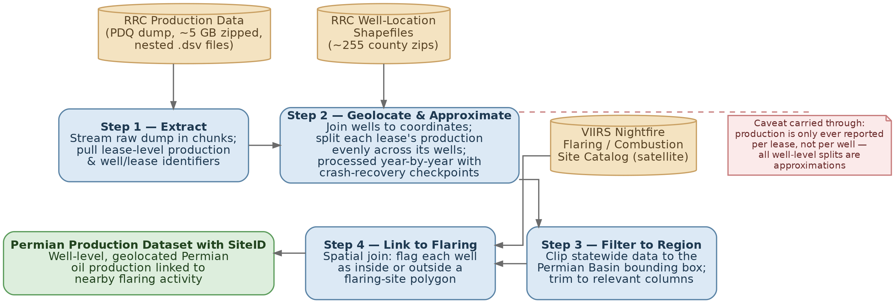

> **Flowchart Details:**
> - **Inputs:** RRC Production Data (PDQ dump, ~5 GB zipped, nested .dsv files) | RRC Well-Location Shapefiles (~255 county zips)
> - **Step 1 — Extract:** Stream raw dump in chunks; pull lease-level production & well/lease identifiers
> - **Step 2 — Geolocate & Approximate:** Join wells to coordinates; split each lease's production evenly across its wells; processed year-by-year with crash-recovery checkpoints
> - **External Input:** VIIRS Nightfire Flaring / Combustion Site Catalog (satellite)
> - **Step 3 — Filter to Region:** Clip statewide data to the Permian Basin bounding box; trim to relevant columns
> - **Step 4 — Link to Flaring:** Spatial join: flag each well as inside or outside a flaring-site polygon
> - **Output:** Permian Production Dataset with SiteID (Well-level, geolocated Permian oil production linked to nearby flaring activity)
> - *Caveat carried through: production is only ever reported per lease, not per well — all well-level splits are approximations*

The final dataset here has to be merged with the VIIRS night time lights dataset for further analysis.
(For further information on cleaning and merging these datasets, please refer to the README file in src/data/texas/cleaning.)

### Nighttime Lights
We obtain the Nightfire temporal data from the Earth Observation Group at the Colorado School of Mines under an academic license. We use their site catalog to filter for the Permian basin as [defined](https://services3.arcgis.com/9nfxWATFamVUTTGb/arcgis/rest/services/Permian_Basin_Pipelines_WFL1/FeatureServer/3/metadata?format=default&f=html) by the latitude and longitude boundaries:
West longitude: -105.21988
East longitude: -100.036107
North latitude: 34.021515
South latitude: 29.462935.

Further, the EOG also releases the geometry of each flaring site. Here is a flowchart describing the data gathering and processing from VIIRS database.

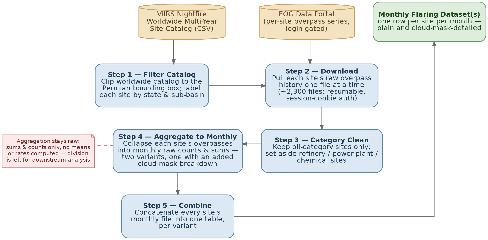

> **Flowchart Details:**
> - **Inputs:** VIIRS Nightfire Worldwide Multi-Year Site Catalog (CSV) | EOG Data Portal (per-site overpass series, login-gated)
> - **Step 1 — Filter Catalog:** Clip worldwide catalog to the Permian bounding box; label each site by state & sub-basin
> - **Step 2 — Download:** Pull each site's raw overpass history one file at a time (~2,300 files; resumable, session-cookie auth)
> - **Step 3 — Category Clean:** Keep oil-category sites only; set aside refinery / power-plant / chemical sites
> - **Step 4 — Aggregate to Monthly:** Collapse each site's overpasses into monthly raw counts & sums — two variants, one with an added cloud-mask breakdown
> - **Step 5 — Combine:** Concatenate every site's monthly file into one table, per variant
> - **Output:** Monthly Flaring Dataset(s) (one row per site per month — plain and cloud-mask-detailed)
> - *Note: Aggregation stays raw: sums & counts only, no means or rates computed — division is left for downstream analysis*

### Combining Datasets
Since leases and Nightfire sites don't necessarily align, we attribute a uniform share of production and flaring to each well in a lease. To each Nightfire site, we then assign the wells that are contained in that site. So we have site by site flaring and production data. This is achieved by merging the final datasets from the last two steps.

Reported flaring in the permian region of Texas:

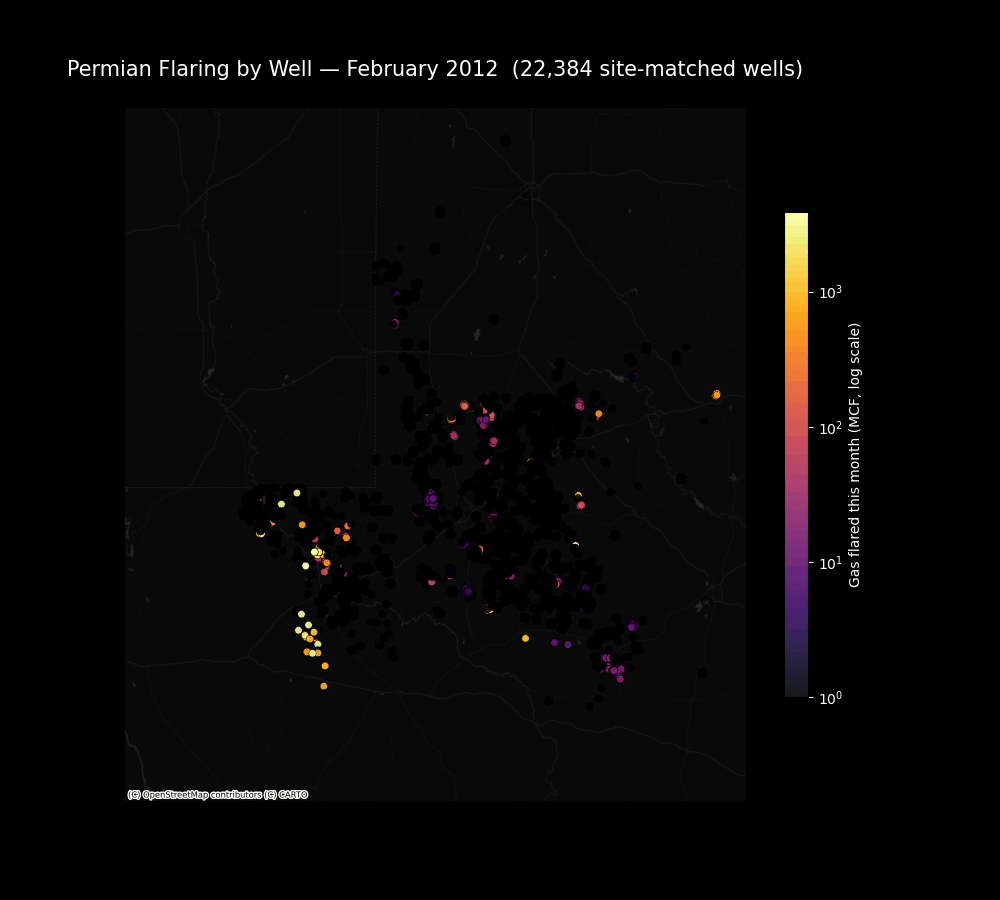

## Exploratory Data Analysis

This following plot looks at the amount of oil production and flaring activity in the Permian region of Texas that falls in and out of the flaring sites identified by the VIIRS satellites.

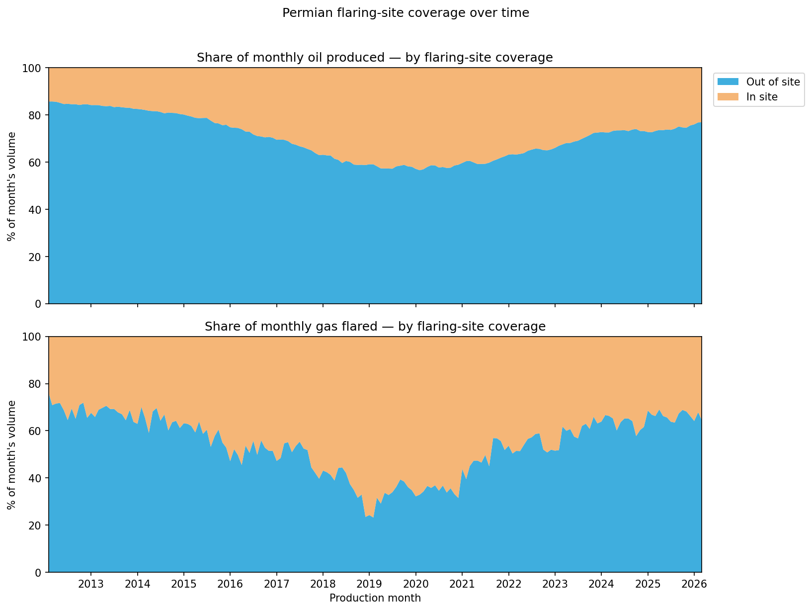

We plot the monthly aggregated VIIRS RH sum and the reported vented/flared gas (mcf). We observe that the two time series move together.

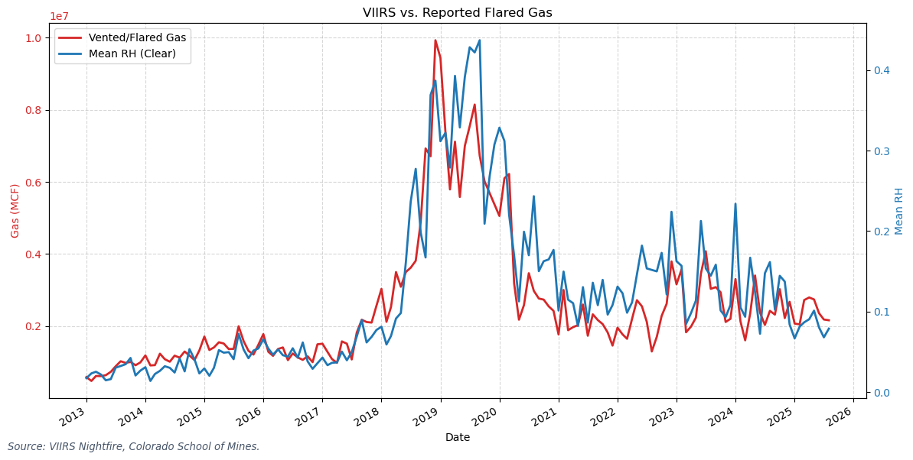

We have the following scatter plot of monthly total reported vented/flared gas against the monthly total VIIRS RH sum. Ordinary least squares regression gives us the line of best fit with $R^2=0.755$

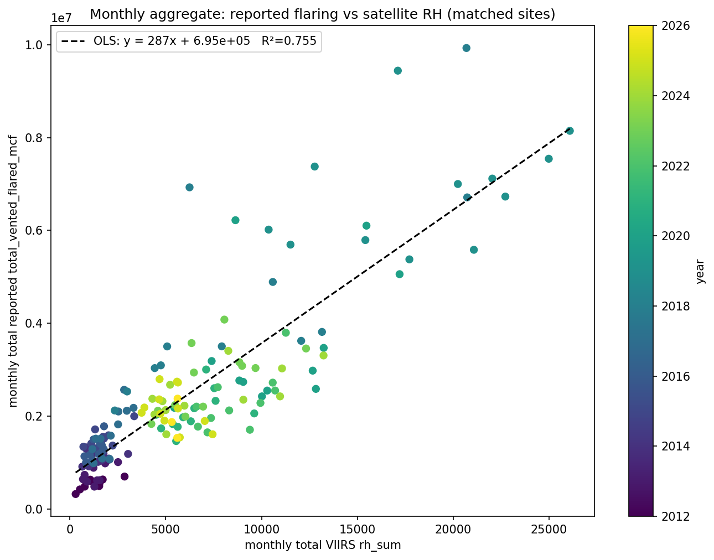

We plot the fraction of the total casinghead gas that is vented/flared with important pipeline infrastructure milestones. After the pipelines came up, the fraction appears to have stabilized at around 0.02.

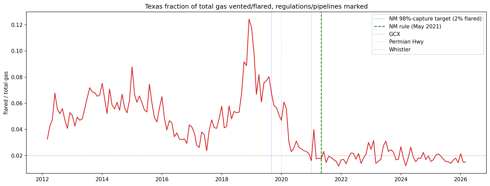

Further, the ratio of total gas produced with total oil produced has also increased, by more than 2x between 2012-2026.

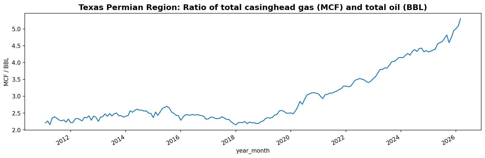

Therefore, in the chain of links:
$$\text{VIIRS RH sum} \longrightarrow \text{Vented/Flared gas} \longrightarrow \text{Total Gas} \longrightarrow \text{Total Oil},$$
the latter two are unstable over the time period we analyze. So the signal in VIIRS RH sum does not filter all the way to the amount of oil produced. We can observe this in the following plot. Until 2019, the oil produced and RH sum both increased to their peak. After 2019 however, oil production has stayed at a similar level whereas the RH sum has declined significantly.

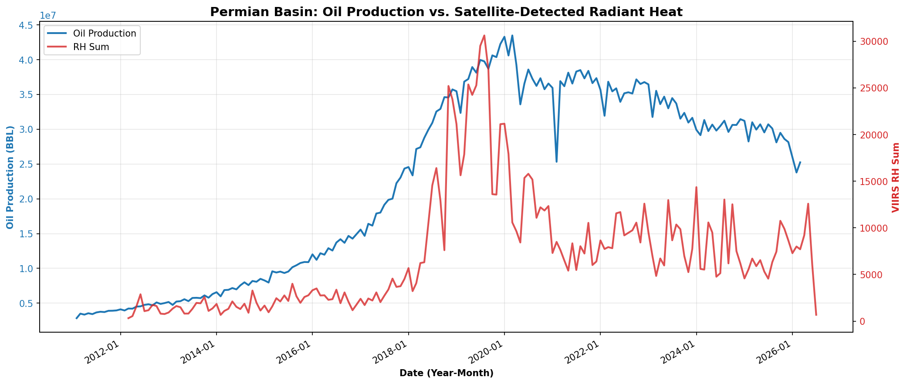

---

## 5. Predicting Oil Production

Section 2 laid out a chain of dependencies: satellite observed flaring should track gas that never reaches a pipeline, that gas is roughly a fixed share of total casinghead gas, and so a good real time flaring proxy should carry a usable signal about oil production itself, well before the Texas RRC figures are finalized. This section tests that chain directly on the matched Texas Permian panel from Section 4, and asks which link in it actually holds.

### 5.1 Baseline

Monthly oil production rises through the shale boom, peaks around 2020, and declines afterward, so the raw series is not stationary. One difference is enough to pass an Augmented Dickey Fuller test at the 1% level.

[ FIGURE 1: raw oil series, plus ACF and PACF before and after differencing ]

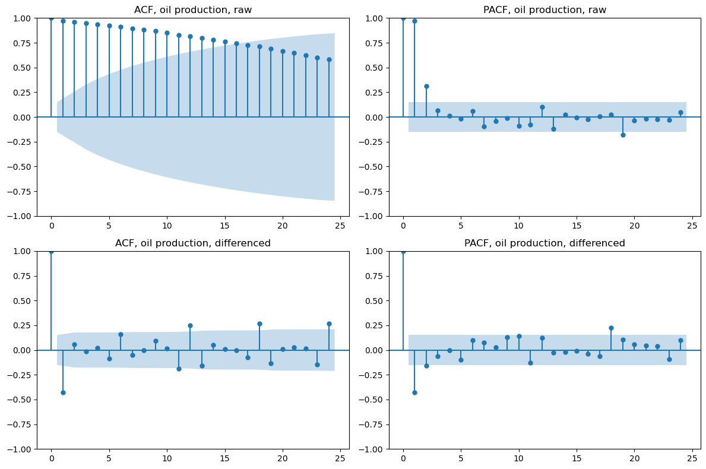

Simple baselines set the bar an ARIMA model has to clear, all evaluated on the same folds so the comparison is exact.

| Model | RMSE (bbl) |
|---|---|
| Mean forecast | 10,777,584 |
| Naive | 3,639,914 |
| Drift | 4,934,090 |
| ARIMA(0,1,1) | 3,531,210 |

**Conclusion.** Oil's own history, modeled with a low order ARIMA, beats every simple baseline and is a strong, honest reference point. Anything added later has to beat this, not just correlate with oil.

### 5.2 Can gas or satellite data improve the forecast

Gas transmission volume (how much casinghead gas reaches a pipeline) and VIIRS radiant heat (available daily) were each tested as ARIMA exogenous regressors against the same baseline, in the same cross validation folds.

[ FIGURE 2: oil, gas transmission, and VIIRS radiant heat, normalized and overlaid on one plot ]

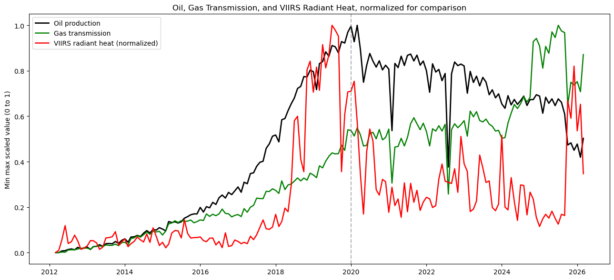

| Predictor | Available in real time | Full history | 2020 onward |
|---|---|---|---|
| Gas transmission | No | +18% | +22% |
| Flaring plus transmission | No | +19% | +22% |
| VIIRS radiant heat (normalized) | Yes | +2% | +3% |
| VIIRS detection rate | Yes | 0% | about 2% worse |
| Pipeline proxy (smoothed VIIRS) | Yes | about 6% worse | about 14% worse |

**Conclusion.** Gas transmission meaningfully improves the forecast, but it is reported on the same lag as oil, so it cannot be used for nowcasting. Every signal that is actually available in real time gives almost no improvement, and the smoothed proxy is worse than doing nothing. This is the central finding of this section.

[ FIGURE 3: full history of oil production, with a held out test period showing actual values against four forecasts: the plain baseline, the log ARIMA baseline, ARIMA with VIIRS added, and ARIMA with gas transmission added ]

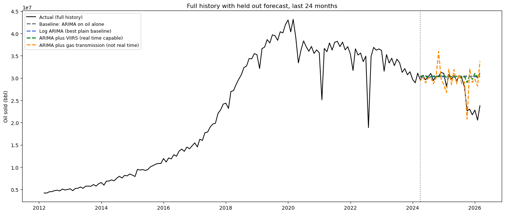

Zooming into an actual held out period makes the table above concrete. Holding out the last 24 months gives RMSE of 4,126,442 for the plain baseline, 4,047,051 for log ARIMA, 4,016,913 for ARIMA plus VIIRS, and 4,066,970 for ARIMA plus gas transmission. In this particular window VIIRS actually edges out gas transmission, the opposite of the pattern in the cross validated tables above, which is exactly why this section relies on averages across many folds rather than any single held out window. The plain and log ARIMA baselines still flatten out into a nearly constant forecast once the horizon extends a few months past the training window, since that is the best a model can do with no outside information, and that flattening is the more consistent visual takeaway across windows.

### 5.3 Why the satellite signal does not generalize

Splitting the sample at 2020 shows the correlation between the pipeline proxy and oil is strong before 2020 (about 0.86) and weak after (about 0.27). Plotting oil against each gas or VIIRS signal, colored by year, shows why: the relationship is a loop, not a line. Oil rises with these signals early in a well's life and keeps declining later even as the signals stay flat or rise, because wells mature and deplete. A single linear coefficient cannot represent both arms of that loop at once.

| Signal | R squared, linear fit | R squared, quadratic fit |
|---|---|---|
| Gas transmission | 0.60 | 0.88 |
| Flaring | 0.45 | 0.71 |
| VIIRS radiant heat | 0.45 | 0.69 |
| Pipeline proxy | 0.59 | 0.79 |

[ FIGURE 4: oil versus each signal, colored by year, with linear and quadratic fit overlaid ]

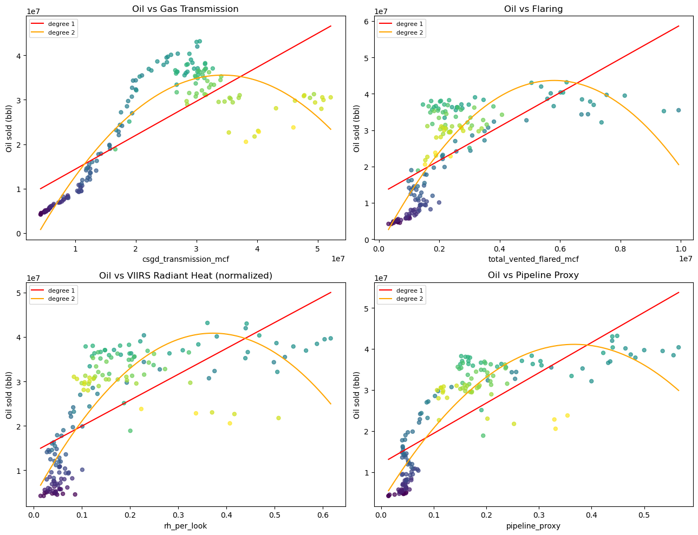

[ FIGURE 5: oil versus the pipeline proxy, split into a rising arm before the production peak and a falling arm after it, each fit with its own straight line ]

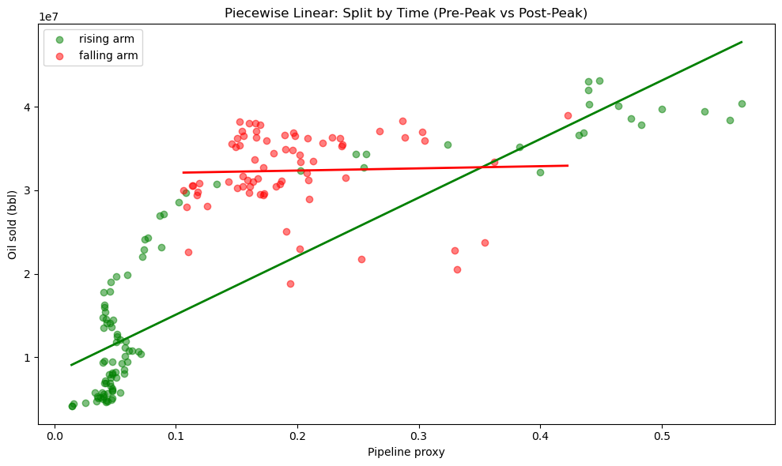

Splitting the same relationship by time relative to the production peak, rather than fitting one curve across the whole period, gives a cleaner picture than the quadratic above. Two straight lines, one for the rising arm and one for the falling arm, separate the data far better than a single curve drawn through both at once. The rising arm has a clear positive slope. The falling arm is close to flat. This is the same loop described numerically in the table above, shown as what it actually is: two different relationships, not one bent one.

**Conclusion.** The jump in R squared from a linear to a quadratic fit, repeated across every signal, shows this loop is a real structural feature of the data, not noise. Adding polynomial terms directly into the forecasting model did not help, since squaring a signal and then differencing it amplifies noise more than it captures curvature.

### 5.4 A closer look at the one real bottleneck

Splitting months by flaring intensity into low, medium, and high regimes shows exactly where the chain breaks.

| Flaring regime | Months | Correlation between flaring and transmission |
|---|---|---|
| Low | 84 | 0.68 |
| Medium | 73 | 0.92 |
| High (the 2018 to 2019 pipeline bottleneck) | 12 | 0.08 |

Flaring and transmission move together closely under normal conditions but decouple almost completely during the one clear capacity bottleneck in the sample. Tested directly within that window, gas transmission still gave a 4.1% forecast improvement, while flaring alone gave a 1.4% decline.

**Conclusion.** The unstable link in the chain is not that satellites fail to measure flaring. It is the assumption that flaring is a stable, proportional signal of activity. That holds only while pipeline capacity is not maxed out. Once it is, flaring becomes a symptom of the constraint rather than a leading indicator of production.

### 5.5 Summary

Oil's own history, modeled with ARIMA, is a strong baseline that is hard to beat with the data available in real time. Gas transmission volume is a genuinely strong predictor of oil, but it shares oil's own reporting lag and so cannot be used for nowcasting as is. VIIRS satellite data, the one input that truly is available in real time, gave no meaningful improvement over the baseline in any version we tested. The relationship between gas activity and oil is structurally nonlinear, tracing the rise and decline of a maturing field rather than a stable line, and it breaks down further whenever pipeline capacity is constrained. Section 6 turns to a direct comparison between VIIRS observed and RRC reported flaring volumes.

---

## 6. Flaring Time-Series Modeling & Nowcasting

* **Overview of the Analysis:** Natural gas venting and flaring in the Texas Permian Basin is a critical environmental and economic indicator, but official regulatory reporting suffers from a persistent administrative delay. This analysis establishes an operational "nowcasting" model that converts daily orbital satellite thermal data into flared gas volume predictions. By bridging the information gap between real-time physical flaring and delayed regulatory filings, this framework provides immediate visibility into basin-wide gas production and infrastructure bottlenecks.

* **Model Identification (In-Sample Analysis):** To construct a reliable forecasting tool, we first examined the historical relationship between ground-truth flaring volumes reported to the Texas Railroad Commission (RRC) and infrared radiant heat measurements captured by the orbital VIIRS (Visible Infrared Imaging Radiometer Suite) satellite sensor.

* **Visualizing the Physical Proxy:** As shown in the VIIRS vs. Reported Flared Gas plot below, orbital thermal energy (red line) tracks reported physical gas volumes (orange line) with exceptional historical fidelity from 2013 through 2026. This confirms that satellite radiant heat serves as a highly dependable physical indicator for ground-level combustion.

* **Choosing The ARIMAX Model:** To translate raw thermal data into volumetric gas measurements (in thousands of cubic feet, or MCF), we evaluated multiple statistical and machine learning architectures across our historical training data. The Comprehensive Model Estimation & Residual Diagnostics table highlights the clear winner:
  i. **ARIMAX (1,1,1):** The non-seasonal ARIMAX(1,1,1) model outperformed all competitors, achieving the lowest complexity-penalized scores (AIC: 67.74, BIC: 79.21). This proves that adding complex 12-month seasonal rules adds unnecessary complexity without improving accuracy.
  ii. **Pure Signal Extraction:** A superior time-series model must absorb all actual physical patterns, leaving behind only random, unpredictable errors (white noise). Our ARIMAX(1,1,1) model successfully generated pure white noise residuals ($\text{Prob}(Q)=0.81$, $\text{Prob}(JB)=0.84$), confirming that 100% of the useful satellite signal was captured with stable error variance across both quiet and volatile years.
  iii. **Why Machine Learning Failed:** While the unconstrained XGBoost decision tree model is a powerful machine learning tool, it failed every statistical time-series diagnostic ($\text{Prob}(Q)=0.00$, fat-tailed Kurtosis of 6.36). Because decision trees group historical data into static bounding boxes rather than modeling continuous sequential momentum, they hit an artificial ceiling during extreme volume spikes and leave obvious, predictable patterns behind in their errors.

### Comprehensive Model Estimation & Residual Diagnostics

| Evaluation Metric | SARIMAX(0, 1, 0) (Random Walk) | SARIMAX(1, 1, 1) x (1, 0, 0, 12) | ARIMAX(1, 1, 1) | XGBoost (Unconstrained) |
| :--- | :---: | :---: | :---: | :---: |
| **AIC** (In-Sample Complexity Penalty) | 81.441 | 68.995 | 67.743 | N/A (Tree Ensemble) |
| **BIC** (Strict Complexity Penalty) | 87.191 | 82.891 | 79.214 | N/A (Tree Ensemble) |
| **Prob(Q)** (Ljung-Box White Noise) | 0.02 (Fail) | 0.70 (Pass) | 0.81 (Pass) | 0.00 (Fail) |
| **Prob(H)** (Variance Stability Over Time) | 0.03 (Fail) | 0.11 (Pass) | 0.05 (Pass) | 0.00 (Fail) |
| **Prob(JB)** (Jarque-Bera Normality) | 0.63 (Pass) | 0.71 (Pass) | 0.84 (Pass) | 0.00 (Fail) |
| **Kurtosis** (Outlier Severity / Tail Risk) | 2.85 | 2.67 | 2.75 | 6.36 (Fat-Tailed) |
| **Skew** (Systematic Prediction Bias) | -0.19 | 0.09 | 0.00 | 0.71 |

* **Out-of-Sample Predictive Power (Real-World Backtesting):** A model must survive the test of time on data it has never seen. To simulate live operational deployment without any hindsight bias, we executed a 92-month walk-forward validation from January 2018 through August 2025. At each monthly step, the algorithm forecasted one month ahead, ingested the newly revealed volume, and dynamically re-estimated its parameters.

* **Key Findings from the Walk-Forward Backtest:** The Walk-Forward Nowcast Comparison chart and the Out-of-Sample Validation Results table demonstrate the model's operational superiority:
  i. **12.0% Lift in Directional Accuracy (MDA):** In commodity markets, correctly predicting the direction of the market (whether flaring is surging or declining) is crucial. A standard ARIMA model lacking satellite data guesses market direction correctly only 56.5% of the time. Incorporating orbital thermal heat surges our Mean Directional Accuracy to 68.5%, providing a massive 12 percentage point advantage in detecting structural market turning points. A static baseline scores 0.0% because it assumes zero change.
  ii. **Increased Precision Over Simple Regression (OLS):** While basic Ordinary Least Squares (OLS) regression matches ARIMAX on directional accuracy (67.4%-68.5%), its absolute volume error more than doubles (>1.33M MCF MAE). Because simple regression lacks autoregressive lag memory to anchor its estimates, its predictions oscillate wildly.
  iii. **Overcoming Tree Extrapolation Limits:** While XGBoost captures general direction decently (65.2% MDA), its inability to extrapolate beyond historical bounding boxes punishes it with an +88,000 MCF MAE penalty compared to our ARIMAX model when unprecedented flaring surges occur. The parametric ARIMAX equation scales smoothly along exponential trajectories.

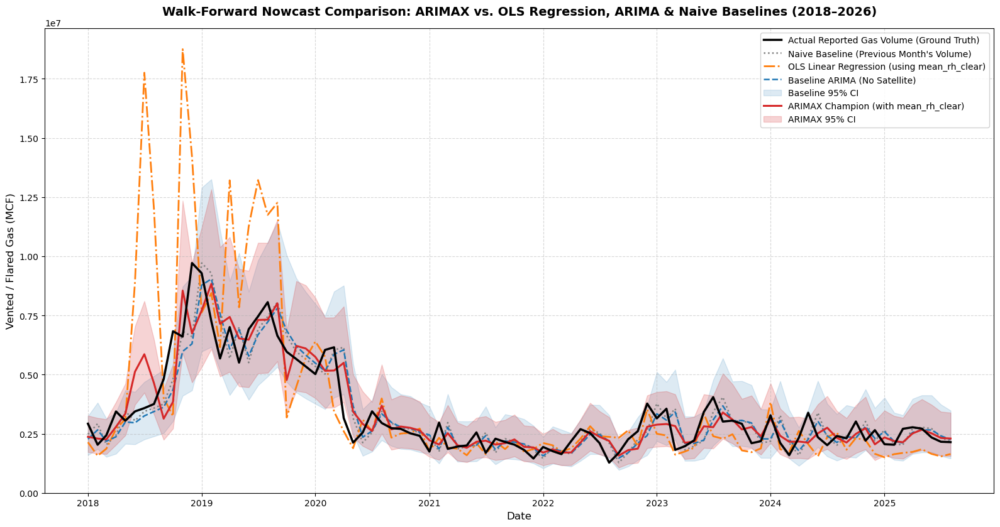

### Out-of-Sample Walk-Forward Validation Results (92 Monthly Iterations: Jan 2018 – Aug 2025)

| Model Specification | Training Window Strategy | Mean Absolute Error (MAE) | Mean Directional Accuracy (MDA) |
| :--- | :---: | :---: | :---: |
| **Naive Baseline** (T-1 Actual Volume) | None (Static) | 652,970 MCF | 0.0% (Flat Line) |
| **OLS Linear Regression** | Expanding | 1,338,612 MCF | 67.4% |
| **Baseline ARIMA(1,1,1)** (No Satellite Data) | Expanding | 648,335 MCF | 56.5% |
| **ARIMAX(1,1,1)** (Satellite-Informed) | Expanding | 638,973 MCF | 68.5% |
| **ARIMAX(1,1,1)** (Satellite-Informed) | Rolling (48-Month) | 640,641 MCF | 69.6% |
| **XGBoost Regressor** (Unconstrained Trees) | Expanding | 726,879 MCF | 65.2% |

*Note: Naive MDA evaluates to 0.0% because a static forecast assumes zero month-over-month change. While OLS Regression almost matches ARIMAX on direction, its MAE doubles (1.33M MCF) because it lacks autoregressive lag memory to anchor volume scaling. Parametric ARIMAX uniquely combines thermal direction with sequential stability.*

## Stakeholder Value and Business Impact 

The overarching value of this forecasting model lies in bridging the regulatory blind spot. Official Texas Railroad Commission flaring reports suffer from a rigid 1- to 2-month administrative publication lag. By running our dynamically adapting ARIMAX model on daily satellite telemetry, we convert orbital heat into high-precision flaring volume estimates weeks before official ground-truth numbers enter the public domain.

**Who Benefits?**
  * **Quantitative Energy & Commodity Traders**
     1. Flaring surges frequently indicate that regional natural gas gathering pipelines (such as Permian Waha takeaway capacity) are maxed out, forcing producers to burn excess gas.
     2. By identifying pipeline bottlenecks 4 to 8 weeks before official regulatory reports confirm them, trading desks can take early, profitable positions in regional natural gas price differentials and spot market contracts.
  * **Environmental Regulators & Compliance Officers (RRC / EPA)**
     1. Transforms environmental oversight from reactive historical reviews to proactive, real-time monitoring.
     2. Compliance teams can immediately cross-reference nowcasts against permitted flaring thresholds, pinpointing unauthorized venting, unlit malfunctioning flares, or acute equipment blowdowns the same week they occur.
  * **Exploration & Production (E&P) Field Operators**
     1. Provides real-time operational benchmarking across adjacent oil and gas leases without waiting for public regulatory releases.
     2. Asset managers can identify chronic field-level flaring hotspots early, justifying capital deployment for new gas capture batteries, micro-LNG generators, or pipeline expansions before regulatory fines or ESG credit downgrades accrue.
  * **Midstream Pipeline & Infrastructure Planners**
     1. Delivers empirical, real-time heat maps showing exactly where associated natural gas production is outstripping existing gathering infrastructure.
     2. Provides data-driven justification for routing new midstream gathering pipelines or expanding compressor station throughput in high-combustion zones.